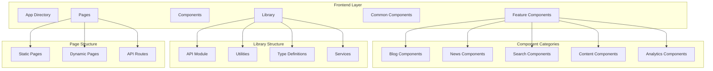

# MaasISO Architecture Analysis

## Current Architecture Overview

## Component Analysis

### Feature Components (45+ components)
1. Content Display
   - BlogPostContent
   - NewsArticleContent
   - TextBlock
   - MarkdownContent
   - HeroComponent

2. Interactive Elements
   - SearchInput
   - ContactForm
   - CategoryFilter
   - WhitepaperDownloadModal

3. Layout Components
   - FeatureGrid
   - ImageGallery
   - SearchResultsGrid
   - TableOfContents

4. Performance Components
   - BlogPostPerformance
   - ContentAnalytics
   - SearchAnalytics

### Identified Patterns & Issues

1. **Redundant Components**
   - Multiple wrapper components (BlogListClientWrapper, BlogPageClientWrapper, NewsPageClientWrapper)
   - Duplicate content handling logic
   - Similar card components (BlogCard, NewsCard, WhitepaperCard)

2. **Performance Concerns**
   - Multiple client-side wrappers increasing bundle size
   - Redundant data fetching patterns
   - Unnecessary re-renders in client components

3. **Maintenance Challenges**
   - Scattered utility functions
   - Inconsistent error handling
   - Duplicate type definitions
   - Mixed responsibility in components

## API Layer Analysis

1. **Current Structure**
   - Monolithic api.ts (648 lines)
   - Mixed concerns (data fetching, mapping, validation)
   - Redundant error handling
   - Inconsistent response mapping

2. **Data Flow Issues**
   - Multiple data transformation layers
   - Redundant type casting
   - Inconsistent error propagation
   - Complex proxy setup

## Identified Areas for Improvement

1. **Component Consolidation**
   - Merge similar wrapper components
   - Create unified card component system
   - Standardize content display patterns
   - Implement shared layout components

2. **API Layer Restructuring**
   - Split api.ts into domain-specific modules
   - Implement consistent data mapping
   - Centralize error handling
   - Add proper type validation

3. **Performance Optimization**
   - Reduce client-side JavaScript
   - Implement proper code splitting
   - Optimize data fetching patterns
   - Add strategic caching

4. **Code Organization**
   - Centralize utility functions
   - Implement proper type sharing
   - Standardize error handling
   - Create clear component boundaries

## Redundant Code Patterns

1. **Component Level**
   - Multiple *ClientWrapper components
   - Duplicate card implementations
   - Similar content display logic
   - Redundant loading states

2. **API Level**
   - Repeated data mapping functions
   - Similar error handling blocks
   - Duplicate type definitions
   - Redundant validation logic

3. **Utility Level**
   - Scattered image handling
   - Multiple slug validation implementations
   - Duplicate date formatting
   - Similar string manipulation

## Technical Debt

1. **Type System**
   - Inconsistent type usage
   - Any types in critical paths
   - Missing validation
   - Duplicate definitions

2. **Error Handling**
   - Mixed error patterns
   - Inconsistent error propagation
   - Missing error boundaries
   - Duplicate error UI

3. **Testing**
   - Incomplete test coverage
   - Inconsistent test patterns
   - Missing integration tests
   - Duplicate test setups

## Proposed Refactoring Phases

1. **Phase 1: Component Consolidation**
   - Create unified component library
   - Implement shared layouts
   - Standardize props and types
   - Remove redundant wrappers

2. **Phase 2: API Restructuring**
   - Split api.ts into modules
   - Implement domain services
   - Add proper validation
   - Optimize data flow

3. **Phase 3: Performance Optimization**
   - Implement code splitting
   - Optimize bundle size
   - Add strategic caching
   - Reduce client JavaScript

4. **Phase 4: Code Cleanup**
   - Remove dead code
   - Consolidate utilities
   - Standardize patterns
   - Update documentation

## Next Steps

1. Create detailed implementation plan for each phase
2. Set up metrics for measuring improvements
3. Implement changes incrementally
4. Validate changes against existing functionality
5. Update documentation with new patterns

Would you like me to proceed with creating a detailed implementation plan for any of these phases?