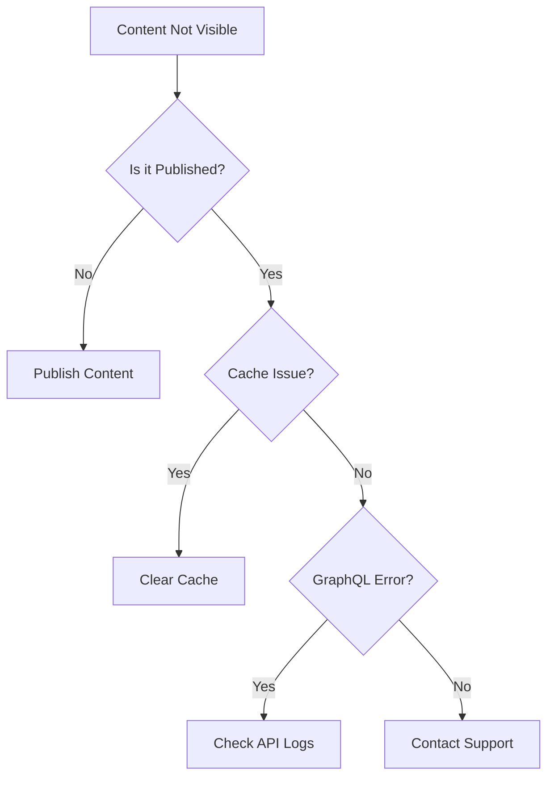

# Content Management Troubleshooting Guide

## Common Issues & Solutions

### 1. Content Not Appearing on Frontend



#### Checklist
1. **Verify Publication Status**
   - Open content in Strapi
   - Check if status is "Published"
   - Look for scheduled publication date

2. **Check Cache**
   ```bash
   # Clear frontend cache
   npm run clear-cache
   
   # Clear API cache
   pm2 restart strapi
   ```

3. **Verify GraphQL Query**
   - Check browser console for errors
   - Verify query in GraphQL playground
   - Test query parameters

### 2. Image Upload Issues

#### Common Problems
1. **File Too Large**
   - Max size: 5MB
   - Solution: Optimize image before upload
   - Recommended tool: [TinyPNG](https://tinypng.com)

2. **Wrong Format**
   - Supported formats: JPG, PNG, WebP
   - Convert using image editor
   - Maintain quality settings

3. **Upload Fails**
   ```mermaid
   graph TD
       A[Upload Fails] --> B{File Size OK?}
       B -->|No| C[Optimize Image]
       B -->|Yes| D{Format OK?}
       D -->|No| E[Convert Format]
       D -->|Yes| F[Check Permissions]
   ```

### 3. Component Issues

#### Component Not Rendering
1. Check component registration
   ```typescript
   // Verify in ComponentRegistry.tsx
   const components = {
     hero: HeroComponent,
     textBlock: TextBlockComponent,
     // ... is your component listed here?
   };
   ```

2. Verify data structure
   ```typescript
   // Expected format
   {
     __typename: "ComponentHero",
     title: string,
     subtitle: string,
     // ... all required fields present?
   }
   ```

3. Check console errors
   - Open browser developer tools
   - Look for React errors
   - Verify component props

### 4. SEO Issues

#### Missing Metadata
1. **Check Required Fields**
   - Title
   - Description
   - OG Image

2. **Verify Length**
   - Title: 50-60 characters
   - Description: 150-160 characters

3. **Test Meta Tags**
   ```bash
   # Use curl to check meta tags
   curl -L https://yoursite.com/page | grep "meta"
   ```

### 5. Performance Issues

#### Slow Page Load
1. **Image Optimization**
   - Check image sizes
   - Verify lazy loading
   - Use WebP format

2. **Component Loading**
   - Check component chunks
   - Verify dynamic imports
   - Monitor bundle size

3. **Cache Configuration**
   ```typescript
   // Verify cache settings
   const cacheConfig = {
     staleTime: 3600,
     revalidate: true
   };
   ```

## Quick Fixes

### 1. Reset Content State
```bash
# In Strapi admin
1. Unpublish content
2. Wait 30 seconds
3. Republish content
```

### 2. Clear System Cache
```bash
# Frontend
npm run clear-cache

# Strapi
pm2 restart strapi
```

### 3. Reset Media Library
```bash
1. Clear browser cache
2. Reload media library
3. Retry upload
```

## When to Contact Support

### Immediate Support Needed
- Database errors
- Server down
- Data loss issues
- Security concerns

### Can Wait for Support
- Performance optimization
- Feature requests
- Non-critical bugs
- Training needs

## Prevention Tips

### 1. Regular Maintenance
- Clear cache weekly
- Check error logs
- Monitor disk space
- Update content regularly

### 2. Best Practices
- Use image optimization
- Follow naming conventions
- Keep backups of content
- Document custom components

### 3. Monitoring
- Check server logs
- Monitor API responses
- Track page performance
- Review error reports

## Error Codes Reference

### API Errors
- `400`: Bad request (check input)
- `401`: Unauthorized (check login)
- `403`: Forbidden (check permissions)
- `404`: Not found (check URL/ID)
- `500`: Server error (contact support)

### Content Errors
- `MEDIA_PROCESSING`: Image processing failed
- `INVALID_RELATION`: Broken content relations
- `VALIDATION_ERROR`: Required fields missing
- `UNIQUE_CONSTRAINT`: Duplicate content

## Revision History
- **Date:** 2025-01-16
- **Description:** Created troubleshooting guide
- **Author:** AI
