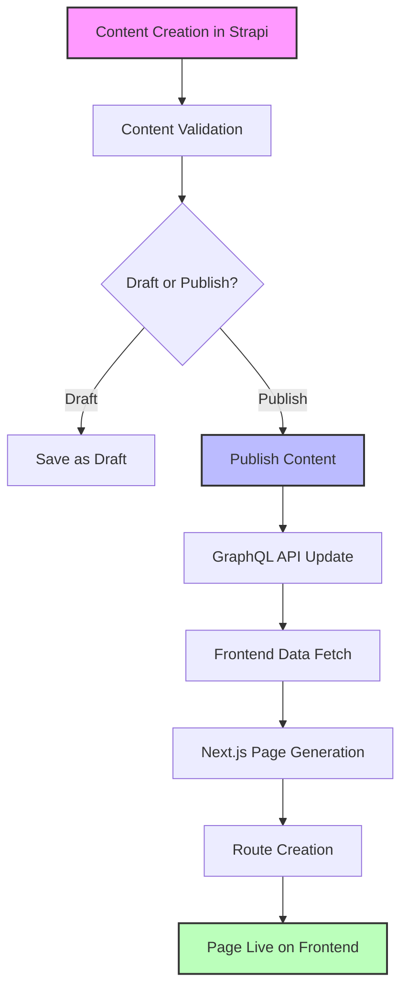
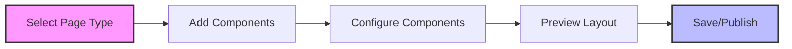
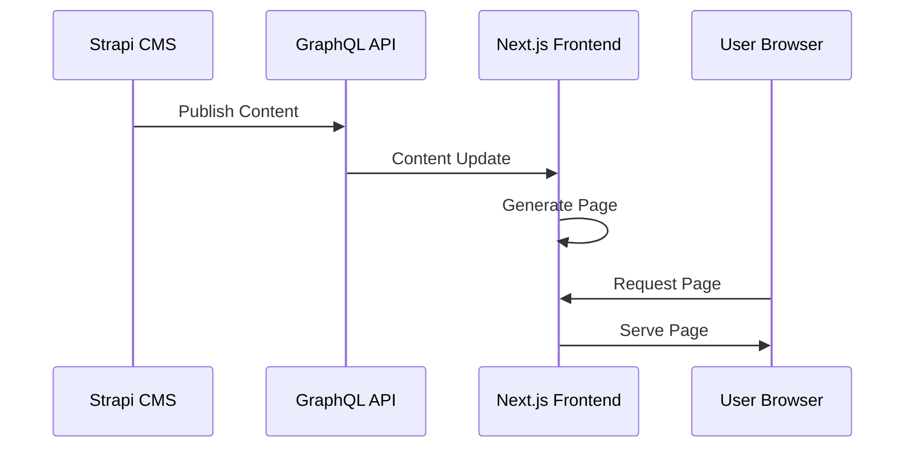
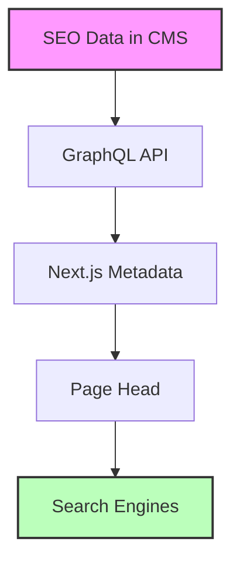
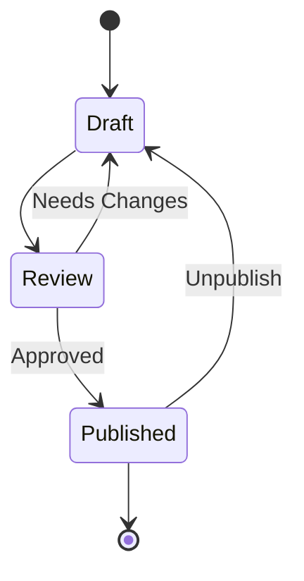

# MaasISO Content Workflow Guide

## Overview

This guide explains the complete content workflow from creation to publication, including how content moves through the system and appears on the frontend.

## Content Flow Diagram



## Detailed Workflow Steps

### 1. Content Creation (Strapi CMS)

#### Accessing the CMS
- URL: http://153.92.223.23:1337/admin
- Login with your credentials
- Navigate to the appropriate content type

#### Available Content Types
1. **Dynamic Pages**
   - Custom pages built with components
   - Flexible layout using dynamic zones
   - SEO settings per page

2. **Blog Posts**
   - Article-style content
   - Rich text editor
   - Category and tag support

3. **News Articles**
   - News-specific content
   - Publication date scheduling
   - Featured image support

### 2. Using the Dynamic Page Builder



#### Available Components
1. **Hero Section**
   ```json
   {
     "type": "hero",
     "fields": {
       "title": "string",
       "subtitle": "string",
       "backgroundImage": "media",
       "ctaButton": {
         "text": "string",
         "link": "string"
       }
     }
   }
   ```

2. **Text Block**
   ```json
   {
     "type": "textBlock",
     "fields": {
       "title": "string",
       "content": "richtext",
       "alignment": "enum(left,center,right)"
     }
   }
   ```

3. **Feature Grid**
   ```json
   {
     "type": "featureGrid",
     "fields": {
       "title": "string",
       "features": [{
         "icon": "string",
         "title": "string",
         "description": "string"
       }]
     }
   }
   ```

### 3. Content to Frontend Flow



#### Technical Process
1. **Content Publication**
   ```typescript
   // Strapi automatically updates the GraphQL schema
   type Page {
     id: ID!
     title: String!
     slug: String!
     components: [ComponentUnion!]!
     seo: SEOData
   }
   ```

2. **Frontend Data Fetching**
   ```typescript
   // pages/[slug].tsx
   async function getPageData(slug: string) {
     const data = await fetchAPI(`
       query GetPage($slug: String!) {
         page(slug: $slug) {
           title
           components {
             __typename
             ... on ComponentHero {
               title
               subtitle
               backgroundImage
             }
             ... on ComponentTextBlock {
               title
               content
               alignment
             }
           }
         }
       }
     `, { slug });
     return data;
   }
   ```

3. **Component Rendering**
   ```typescript
   // Component Registry
   const componentMap = {
     hero: HeroComponent,
     textBlock: TextBlockComponent,
     featureGrid: FeatureGridComponent
   };

   // Dynamic Rendering
   components.map(component => {
     const Component = componentMap[component.__typename];
     return <Component key={component.id} {...component} />;
   });
   ```

### 4. SEO and Metadata



#### Implementation
```typescript
// pages/[slug].tsx
export async function generateMetadata({ params }) {
  const page = await getPageData(params.slug);
  
  return {
    title: page.seo.title,
    description: page.seo.description,
    openGraph: {
      title: page.seo.ogTitle,
      description: page.seo.ogDescription,
      images: [page.seo.ogImage]
    }
  };
}
```

### 5. Content Validation

Before publication, content is validated at multiple levels:

1. **CMS Level**
   - Required fields
   - Format validation
   - Media requirements

2. **API Level**
   - Type validation
   - Relationship integrity
   - Slug uniqueness

3. **Frontend Level**
   - Component props validation
   - Image optimization
   - Link validation

### 6. Publishing Workflow



#### Publication Steps
1. Create content in CMS
2. Add necessary components
3. Configure SEO settings
4. Preview content
5. Publish when ready

### 7. Performance Considerations

#### Content Caching
```typescript
// frontend/src/lib/cache.ts
export async function getCachedPage(slug: string) {
  const cacheKey = `page:${slug}`;
  
  // Check cache first
  const cached = await cache.get(cacheKey);
  if (cached) return cached;
  
  // Fetch and cache if not found
  const page = await getPageData(slug);
  await cache.set(cacheKey, page, '1h');
  
  return page;
}
```

#### Image Optimization
- Automatic WebP conversion
- Responsive sizes
- Lazy loading
- Blur placeholder

## Best Practices

### Content Creation
1. Use clear, descriptive titles
2. Optimize images before upload
3. Preview on multiple devices
4. Include proper meta descriptions

### Component Usage
1. Don't overload pages with components
2. Maintain consistent styling
3. Consider mobile layout
4. Test interactive elements

### SEO
1. Use keyword-rich titles
2. Write compelling meta descriptions
3. Optimize images with alt text
4. Use semantic HTML structure

## Troubleshooting

### Common Issues
1. **Content not updating**
   - Clear API cache
   - Check publication status
   - Verify GraphQL query

2. **Images not loading**
   - Check image format
   - Verify file size
   - Check media permissions

3. **Components not rendering**
   - Verify component registration
   - Check data structure
   - Review console errors

## Revision History
- **Date:** 2025-01-16
- **Description:** Updated to include dynamic page builder workflow
- **Author:** AI
