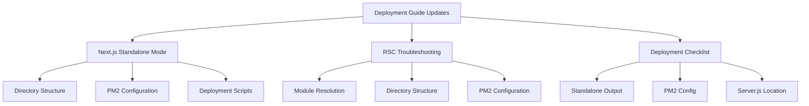

# Deployment Guide Update Plan

## Overview

This document outlines the plan for updating the MaasISO deployment documentation to incorporate recent changes and improvements in deployment processes, particularly around Next.js standalone mode and RSC (React Server Components) implementation.

## Document Structure

## Detailed Implementation Plan

### 1. Next.js Standalone Mode Section

#### Directory Structure
- Document the correct `.next/standalone` structure
- Include file permissions and ownership requirements
- Detail the static assets organization
- Explain critical CSS placement and handling

#### PM2 Configuration
- Document updated ecosystem.config.js settings
- Explain the importance of correct working directory
- Detail environment variable configuration
- Include post-update hooks and their purpose

#### Deployment Script Changes
- Document new deployment script features
- Explain static asset handling improvements
- Detail the process for copying dependencies
- Include verification and health check procedures

### 2. RSC Troubleshooting Section

#### Module Resolution Problems
- Document common module resolution issues
- Include solutions from recent debugging experiences
- Add examples of correct module paths
- Provide verification steps

#### Directory Structure Issues
- Detail required directory layout
- Explain common structural problems
- Include solutions and best practices
- Add verification procedures

#### PM2 Configuration Problems
- Document common PM2 configuration issues
- Include solutions from recent experiences
- Add configuration validation steps
- Provide troubleshooting procedures

### 3. Updated Deployment Checklist

#### Standalone Output Verification
- Add steps to verify output structure
- Include file permission checks
- Detail asset verification procedures
- Add common error resolution steps

#### PM2 Configuration Verification
- Add configuration validation steps
- Include environment variable checks
- Detail working directory verification
- Add process management checks

#### Server.js Location Verification
- Add location verification steps
- Include permission checks
- Detail dependency verification
- Add startup verification procedures

## Implementation Notes

### Code Examples
- Include actual configuration snippets
- Add real-world error examples
- Include successful resolution examples
- Add validation commands

### Cross-References
- Link to RSC debugging document
- Reference deployment scripts
- Link to configuration files
- Include related documentation

### Warning Boxes
- Highlight common pitfalls
- Include critical steps
- Add version-specific warnings
- Detail breaking changes

## Next Steps

1. Switch to code mode for implementation
2. Update deployment-guide.md with new sections
3. Add code examples and configurations
4. Update cross-references and links
5. Verify all changes
6. Update related documentation

## Success Criteria

- All sections properly documented
- Code examples included and verified
- Cross-references accurate and working
- Warning boxes properly highlighted
- Checklist items clear and actionable