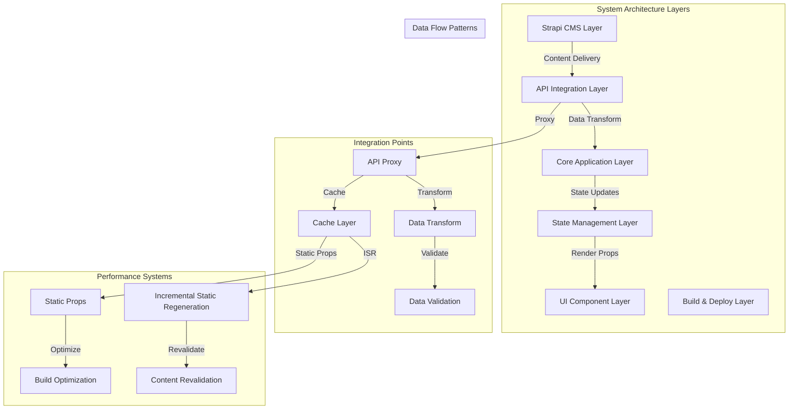
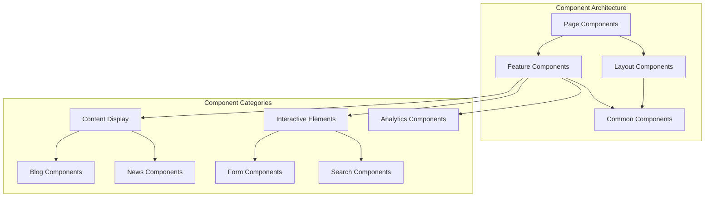
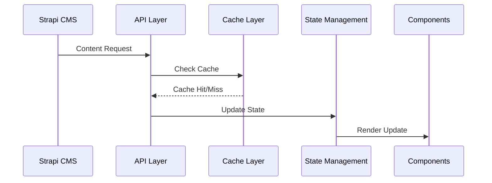
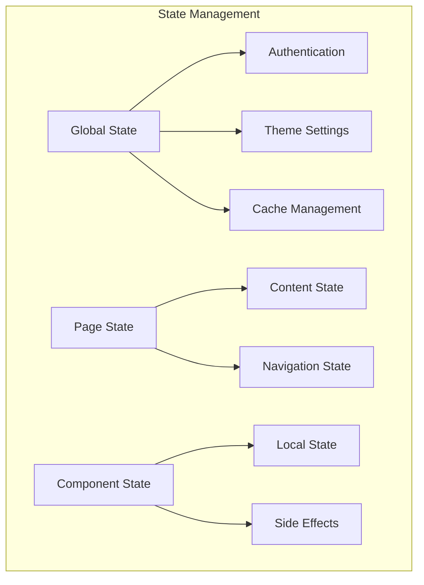
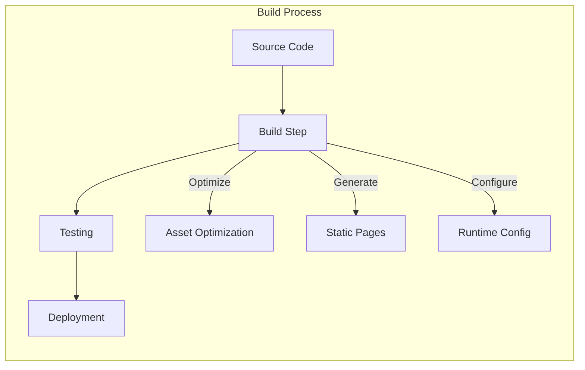

# Expanded Architecture Analysis: MaasISO Project

## 1. System Architecture Layers

### 1.1 CMS Layer (Strapi)
- Hosted on VPS1 (153.92.223.23:1337)
- Content management and delivery
- API token-based authentication
- Media asset management

### 1.2 API Integration Layer
- Next.js API routes
- Proxy implementation for Strapi
- Data transformation and validation
- Error handling and logging

### 1.3 Core Application Layer
- Next.js application framework
- Server-side rendering
- Static page generation
- Dynamic routing

### 1.4 UI Component Layer
- React components
- Tailwind CSS styling
- Responsive design
- Accessibility features

### 1.5 State Management Layer
- React hooks and context
- Client-side caching
- Server state management
- Error boundaries

### 1.6 Build & Deploy Layer
- Standalone output configuration
- Image optimization
- TypeScript compilation
- Webpack bundling

## 2. Component Relationships

### 2.1 Component Categories
1. **Page Components**
   - Dynamic route handling
   - Layout composition
   - SEO management
   - Error handling

2. **Feature Components**
   - Content display (Blog, News)
   - Interactive elements
   - Analytics integration
   - Form handling

3. **Common Components**
   - UI elements
   - Navigation
   - Loading states
   - Error displays

4. **Layout Components**
   - Page structure
   - Responsive containers
   - Grid systems
   - Navigation menus

## 3. Data Flow Patterns

### 3.1 Content Flow
1. **Content Creation**
   - Strapi CMS input
   - Media asset upload
   - Content validation
   - Version control

2. **Content Delivery**
   - API requests
   - Data transformation
   - Caching strategy
   - Error handling

3. **Content Rendering**
   - Component hydration
   - Dynamic imports
   - Lazy loading
   - SEO optimization

## 4. State Management Structure

### 4.1 State Categories
1. **Global State**
   - Authentication
   - Theme settings
   - Cache management
   - User preferences

2. **Page State**
   - Content data
   - Navigation state
   - Form states
   - Loading states

3. **Component State**
   - Local UI state
   - Side effects
   - Error states
   - Animation states

## 5. Build & Deployment Configuration

### 5.1 Build Configuration
- Output: standalone
- TypeScript compilation
- Image optimization
- Code splitting

### 5.2 Deployment Settings
- Environment variables
- API endpoints
- Cache configuration
- Security headers

## 6. Performance Optimization

### 6.1 Current Strategies
- Image optimization
- Code splitting
- Cache management
- Static generation

### 6.2 Identified Bottlenecks
- API response times
- Image loading
- Client-side bundle size
- Cache invalidation

### 6.3 Optimization Opportunities
- Enhanced caching
- Better code splitting
- Image optimization
- API response optimization

## 7. Security Considerations

### 7.1 Current Security Measures
- API token authentication
- Security headers
- CORS configuration
- Input validation

### 7.2 Security Recommendations
- Enhanced error handling
- Rate limiting
- Request validation
- Security monitoring

## 8. Testing Infrastructure

### 8.1 Current Testing Approach
- Content validation
- Component testing
- API integration tests
- Performance monitoring

### 8.2 Testing Improvements
- Automated testing
- Integration testing
- End-to-end testing
- Performance testing

## 9. Next Steps

### 9.1 Immediate Actions
1. Implement enhanced error handling
2. Optimize API response times
3. Improve cache management
4. Enhance testing coverage

### 9.2 Long-term Improvements
1. Component consolidation
2. API restructuring
3. Performance optimization
4. Security enhancements

## 10. Monitoring and Maintenance

### 10.1 Current Monitoring
- Error logging
- Performance metrics
- API response times
- Cache effectiveness

### 10.2 Maintenance Strategy
- Regular updates
- Security patches
- Performance optimization
- Documentation updates