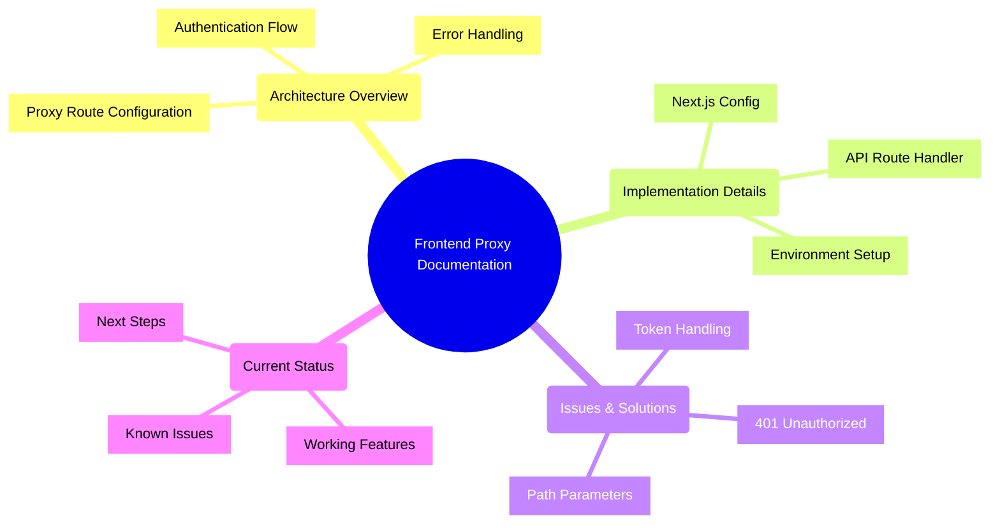
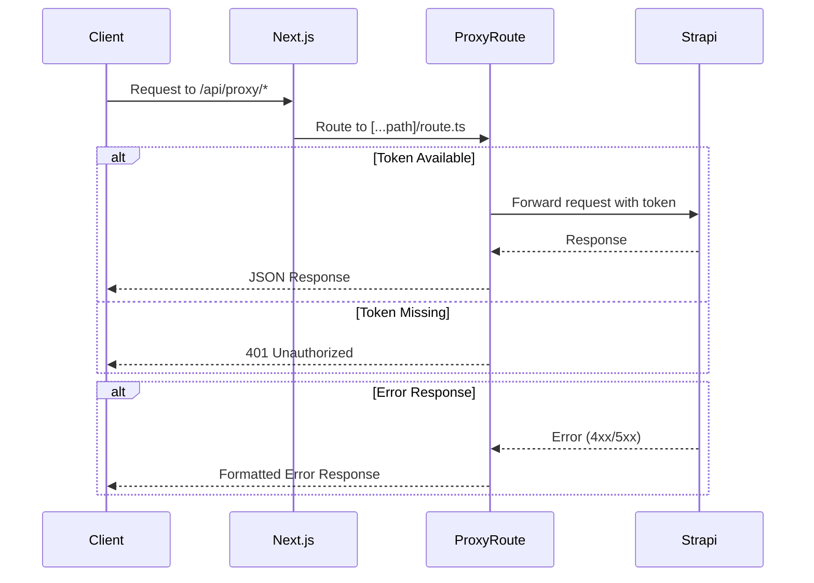

# Frontend Proxy Documentation

## Architecture Overview



### Authentication Flow



### Proxy Route Configuration

The proxy is configured in `next.config.js` to forward all requests from `/api/proxy/*` to the Strapi backend:

```javascript
async rewrites() {
  return [
    {
      source: '/api/proxy/:path*',
      destination: 'http://153.92.223.23:1337/api/:path*'
    }
  ]
}
```

### Error Handling Strategy

The proxy implements comprehensive error handling:
- Token validation errors (401)
- Strapi API errors (4xx/5xx)
- Internal server errors (500)
- Path parameter validation

## Implementation Details

### Next.js Configuration

Key configuration elements in `next.config.js`:
- Proxy route rewrite rules
- Image domains for Strapi assets
- Output configuration for standalone builds
- Experimental features enabled

### API Route Handler

The proxy route handler (`app/api/proxy/[...path]/route.ts`) implements:

1. Token Validation:
```typescript
const token = process.env.STRAPI_TOKEN || process.env.NEXT_PUBLIC_STRAPI_TOKEN;
if (!token) {
  throw new Error('STRAPI_TOKEN environment variable is not set');
}
```

2. Path Parameter Handling:
```typescript
const pathArray = await Promise.resolve(params.path);
const path = pathArray.join('/');
```

3. Request Forwarding:
```typescript
const response = await fetch(url, {
  method: request.method,
  headers: {
    'Authorization': `Bearer ${token}`,
    'Content-Type': 'application/json',
    'Accept': 'application/json'
  },
  cache: 'no-store'
});
```

### Environment Setup

Required environment variables:
```env
NEXT_PUBLIC_API_URL=/api/proxy
STRAPI_URL=http://153.92.223.23:1337
NEXT_PUBLIC_ASSET_PREFIX=http://153.92.223.23:1337
NEXT_PUBLIC_STRAPI_TOKEN=[token]
STRAPI_TOKEN=[token]
```

## Issues & Solutions

### 401 Unauthorized Errors

1. Root Causes:
   - Token not properly set in environment
   - Token mismatch between STRAPI_TOKEN and NEXT_PUBLIC_STRAPI_TOKEN
   - PM2 process name mismatch causing environment variable issues

2. Solutions:
   - Added both STRAPI_TOKEN and NEXT_PUBLIC_STRAPI_TOKEN
   - Fixed PM2 process name in ecosystem.config.js
   - Improved error handling in proxy route

### Token Handling

1. Configuration Issues:
   - PM2 process name mismatch:
     - ecosystem.config.js used "maasiso"
     - Deployment scripts used "frontend"
   - This caused two separate instances with different environments

2. Solution:
   - Changed app name in ecosystem.config.js to match deployment scripts
   - Created documentation for token deployment
   - Improved error handling for token validation

### Path Parameter Handling

1. Implementation Challenges:
   - Next.js dynamic route parameters needed special handling
   - Search parameters needed to be preserved
   - Path joining required careful implementation

2. Solution:
```typescript
const pathArray = await Promise.resolve(params.path);
const path = pathArray.join('/');
const searchParams = request.nextUrl.searchParams.toString();
const url = `${strapiUrl}/api/${path}${searchParams ? `?${searchParams}` : ''}`;
```

## Current Status

### Working Features
- Proxy route configuration
- Basic token authentication
- Error handling and logging
- Path parameter handling
- Search parameter forwarding

### Known Issues
- 401 errors still occurring in some cases
- Token refresh mechanism needed
- Need to verify token format in all Strapi requests

### Next Steps

1. Token Handling Improvements:
   - Implement token refresh mechanism
   - Add token validation middleware
   - Improve error messages for token issues

2. Testing:
   - Create comprehensive test suite for proxy routes
   - Test different API endpoints
   - Verify error handling scenarios

3. Monitoring:
   - Add detailed logging for debugging
   - Monitor token usage and expiration
   - Track API response times

4. Documentation:
   - Update deployment guides
   - Add troubleshooting section
   - Document common error scenarios