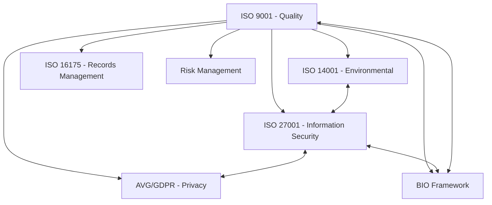

# Website Service Structure and Internal Linking Analysis

Based on my examination of the website structure and your responses, I've developed a comprehensive understanding of your service pages and their relationships. Below is my complete linking strategy plan.

## 1. Current Website Structure

### Main Service Pages
- `/iso-9001` - Quality Management System
- `/iso-14001` - Environmental Management System
- `/iso-27001` - Information Security Management
- `/iso-16175` - Records Management in Business Environment
- `/avg` - AVG/GDPR Privacy Compliance

### Consultancy Pages (Under /diensten)
- `/diensten/iso-9001-consultancy`
- `/diensten/iso-14001-consultancy`
- `/diensten/iso-27001-consultancy`
- `/diensten/iso-16175-consultancy`
- `/diensten/avg-gdpr-consultancy`
- `/diensten/bio-consultancy`
- `/diensten/risicobeheer-consultancy`

### Services Overview Page
- `/diensten` - Main services overview that lists and links to individual service pages

## 2. Page Structure Analysis

From examining the page source code, I've found:

1. **Main Service Pages** (e.g., `/iso-9001`, `/iso-27001`)
   - Use a consistent structure with components like hero sections, text blocks, feature grids
   - Feature grid components (`page-blocks.feature-grid`) are prime locations for internal links
   - These pages can link to both consultancy services and related standards

2. **Consultancy Pages** (e.g., `/diensten/iso-9001-consultancy`)
   - Similar structure to main pages but with more focused content
   - These should link back to their parent service page and potentially to related consultancy services

3. **Services Overview Page** (`/diensten`)
   - Contains a feature carousel that displays service cards
   - Links to individual services through the `FeatureCard` component
   - Could be enhanced to show relationships between services

## 3. Logical Relationships Between Services

Based on your guidance, I've mapped the following relationships:



## 4. Proposed Internal Linking Strategy

### Bi-directional Main Service ↔ Consultancy Links
- Each main service page should link to its corresponding consultancy page
- Each consultancy page should link back to its parent service page

### Related Standards Links (Based on Logical Relationships)
1. **ISO 9001 (Quality Management)**
   - Links to all other service pages (foundational)
   
2. **ISO 14001 (Environmental Management)**
   - Links to ISO 9001 (foundational relationship)
   - Links to ISO 27001 (complementary relationship)
   
3. **ISO 27001 (Information Security)**
   - Links to ISO 9001 (foundational relationship)
   - Links to ISO 14001 (complementary relationship)
   - Links to AVG/GDPR (privacy and security relationship)
   - Links to BIO framework (security framework relationship)
   
4. **ISO 16175 (Records Management)**
   - Links to ISO 9001 (foundational relationship)
   - Links to ISO 27001 (information management aspect)
   
5. **AVG/GDPR (Privacy Compliance)**
   - Links to ISO 27001 (security and privacy relationship)
   - Links to ISO 9001 (foundational relationship)
   
6. **BIO Framework**
   - Links to ISO 27001 (security relationship)
   - Links to ISO 9001 (foundational relationship)
   
7. **Risk Management**
   - Links to ISO 9001 (foundational relationship)
   - Links to ISO 27001 (security risk relationship)

## 5. Complete Link Mapping Visualization

Here is a comprehensive visualization of all the proposed links:

```mermaid
graph TD
    D[/diensten] --- A
    D --- B
    D --- C
    D --- ISO16
    D --- AVG
    D --- BIO
    D --- RISK
    
    A[/iso-9001] <--> ACONS[/diensten/iso-9001-consultancy]
    A --- B
    A --- C
    A --- ISO16
    A --- AVG
    A --- BIO
    A --- RISK
    
    B[/iso-14001] <--> BCONS[/diensten/iso-14001-consultancy]
    B --- A
    B --- C
    
    C[/iso-27001] <--> CCONS[/diensten/iso-27001-consultancy]
    C --- A
    C --- B
    C --- AVG
    C --- BIO
    
    ISO16[/iso-16175] <--> ISO16CONS[/diensten/iso-16175-consultancy]
    ISO16 --- A
    ISO16 --- C
    
    AVG[/avg] <--> AVGCONS[/diensten/avg-gdpr-consultancy]
    AVG --- A
    AVG --- C
    
    BIO[BIO Framework] <--> BIOCONS[/diensten/bio-consultancy]
    BIO --- A
    BIO --- C
    
    RISK[Risk Management] <--> RISKCONS[/diensten/risicobeheer-consultancy]
    RISK --- A
    RISK --- C
```

## 6. Link Placement Within Pages

Based on the page structure analysis, I recommend the following link placements:

1. **Within Feature Grids**
   - Most service pages have a feature grid component that displays related services
   - These are ideal locations for adding related service links
   - Example from ISO 9001 page:
   ```jsx
   <FeatureCard
     key={feature.id}
     title="ISO 14001 Certificering"
     content="Onze milieumanagementsysteem diensten complementeren uw kwaliteitsmanagementsysteem."
     icon={environmentIcon}
     showMoreInfo={false}
     link="/iso-14001"
   />
   ```

2. **Within Text Blocks**
   - Text blocks often contain mentions of other standards or services
   - These mentions can be converted to hyperlinks
   - Example:
   ```jsx
   <ReactMarkdown>
     {`... complementair aan [ISO 27001](/iso-27001) voor informatiebeveiliging ...`}
   </ReactMarkdown>
   ```

3. **In Call-to-Action Sections**
   - Button sections at the end of pages can suggest related services
   - Example:
   ```jsx
   <section>
     <h2>Gerelateerde Diensten</h2>
     <div className="flex space-x-4">
       <a href="/iso-14001" className="text-[#00875A]">ISO 14001</a>
       <a href="/iso-27001" className="text-[#00875A]">ISO 27001</a>
     </div>
   </section>
   ```

## 7. Detailed File-to-File Link Mapping

| Source Page | Should Link To |
|-------------|---------------|
| `/diensten/page.tsx` | All individual service pages (already exists in feature carousel) |
| `/iso-9001/page.tsx` | `/diensten/iso-9001-consultancy`, `/iso-14001`, `/iso-27001`, `/iso-16175`, `/avg`, `/diensten/bio-consultancy`, `/diensten/risicobeheer-consultancy` |
| `/iso-14001/page.tsx` | `/diensten/iso-14001-consultancy`, `/iso-9001`, `/iso-27001` |
| `/iso-27001/page.tsx` | `/diensten/iso-27001-consultancy`, `/iso-9001`, `/iso-14001`, `/avg`, `/diensten/bio-consultancy` |
| `/iso-16175/page.tsx` | `/diensten/iso-16175-consultancy`, `/iso-9001`, `/iso-27001` |
| `/avg/page.tsx` | `/diensten/avg-gdpr-consultancy`, `/iso-9001`, `/iso-27001` |
| `/diensten/iso-9001-consultancy/page.tsx` | `/iso-9001`, other related consultancy services |
| `/diensten/iso-14001-consultancy/page.tsx` | `/iso-14001`, `/diensten/iso-9001-consultancy`, `/diensten/iso-27001-consultancy` |
| `/diensten/iso-27001-consultancy/page.tsx` | `/iso-27001`, `/diensten/iso-9001-consultancy`, `/diensten/avg-gdpr-consultancy`, `/diensten/bio-consultancy` |
| `/diensten/iso-16175-consultancy/page.tsx` | `/iso-16175`, `/diensten/iso-9001-consultancy`, `/diensten/iso-27001-consultancy` |
| `/diensten/avg-gdpr-consultancy/page.tsx` | `/avg`, `/diensten/iso-27001-consultancy`, `/diensten/iso-9001-consultancy` |
| `/diensten/bio-consultancy/page.tsx` | `/diensten/iso-27001-consultancy`, `/diensten/iso-9001-consultancy` |
| `/diensten/risicobeheer-consultancy/page.tsx` | `/diensten/iso-9001-consultancy`, `/diensten/iso-27001-consultancy` |

## 8. Implementation Recommendations

For efficient implementation, I recommend:

1. **Analyze Each Page's Feature Grid Component**
   - Identify if it already contains links to related services
   - Add missing links based on the mapping above
   - Ensure links have appropriate titles and descriptions

2. **Content Scanning**
   - Scan text content for mentions of other standards or services
   - Convert these mentions to appropriate links

3. **Add "Related Services" Section**
   - Consider adding a dedicated section at the end of each page for related services
   - This provides a consistent location for users to find related content

4. **Link Format**
   - Use descriptive anchor text (e.g., "ISO 27001 certificering" instead of just "ISO 27001")
   - Follow existing style guidelines (text color, hover effects)
   - Consider adding subtle visual cues to indicate relationship types

5. **URL Structure**
   - For main services: `/[standard]` (e.g., `/iso-9001`)
   - For consultancy services: `/diensten/[standard]-consultancy` (e.g., `/diensten/iso-9001-consultancy`)