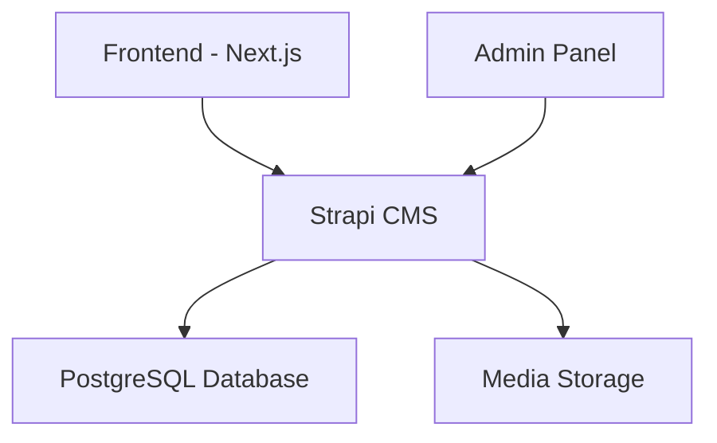

# Chapter 1: System Overview {#system-overview}

<br>

**Document Version:** 1.0  
**Last Updated:** 2025-01-19  
**Status:** Draft  

<br>

---

<div style="page-break-after: always;"></div>

# Table of Contents

1. [Introduction](#introduction)
2. [System Architecture](#architecture)
3. [Environment Setup](#environment-setup)
4. [System Components](#components)
5. [Development vs Production](#environments)
6. [Reference](#reference)

<div style="page-break-after: always;"></div>

# Introduction {#introduction}

<br>

> **Chapter Purpose**  
> This chapter provides a comprehensive overview of the MaasISO CMS system architecture, components, and environments. It serves as the foundation for understanding the entire content management system.

<br>

## Prerequisites

<br>

Before proceeding, ensure you have:

* [ ] Basic understanding of content management systems
* [ ] Familiarity with web technologies
* [ ] Access to system documentation
* [ ] Server access credentials (if applicable)

<br>

> ⚠️ **Important**  
> This documentation assumes familiarity with basic web development concepts and technologies.

<div style="page-break-after: always;"></div>

# System Architecture {#architecture}

<br>

## Core Components

<br>

| Component | Description | Version |
|:----------|:------------|:---------|
| Strapi CMS | Headless CMS backend | v5.7.0 |
| Next.js | Frontend framework | Latest |
| PostgreSQL | Database system | Latest |
| Node.js | Runtime environment | v20.18.1 |

<br>

## Architecture Diagram



<br>

> 💡 **Note**  
> The system uses a headless architecture, separating content management from content presentation.

<div style="page-break-after: always;"></div>

# Environment Setup {#environment-setup}

<br>

## Production Environment

<br>

1. Server Details
   ```bash
   Host: 153.92.223.23
   Type: Hostinger KVM1 VPS
   OS: Ubuntu 22.04 LTS
   ```

2. Access Methods
   - Admin Panel: http://153.92.223.23/admin
   - API Endpoint: http://153.92.223.23/api
   - SSH Access: `ssh root@153.92.223.23`

<br>

## Development Environment

<br>

See [Development Environment Setup](./procedures/development_environment_setup.md) for detailed instructions.

<div style="page-break-after: always;"></div>

# System Components {#components}

<br>

## Content Management Backend

<br>

### Strapi CMS Features
- Admin interface for content management
- Content type builder for schema definition
- Automatic API generation
- Role-based access control
- Media library management
- Plugin system for extensibility

<br>

## Frontend Application

<br>

### Next.js Framework Features
- Server-side rendering for SEO
- Static site generation capabilities
- Dynamic routing system
- API routes for backend communication
- Image optimization
- Internationalization support

<br>

## Database System

<br>

### PostgreSQL Features
- Robust relational database
- JSON field support
- Full-text search capabilities
- Complex querying
- Data integrity enforcement
- Backup and restore functionality

<div style="page-break-after: always;"></div>

# Development vs Production {#environments}

<br>

## Environment Comparison

<br>

| Feature | Development | Production |
|:--------|:------------|:------------|
| Mode | Development | Production |
| Database | Local | Remote |
| Cache | Disabled | Enabled |
| Logging | Verbose | Essential |
| SSL | Optional | Required |

<br>

## Environment Variables

```bash
# Development
NODE_ENV=development
DATABASE_HOST=localhost

# Production
NODE_ENV=production
DATABASE_HOST=153.92.223.23
```

<br>

> ⚠️ **Important**  
> Never use development settings in production environment.

<div style="page-break-after: always;"></div>

# Reference {#reference}

<br>

## Related Documentation
- [Content Type System](../02_content_type_system/index.md)
- [System Administration](../07_system_administration/index.md)
- [Development Guide](../08_development_guide/index.md)

<br>

## External Resources
- [Strapi Documentation](https://docs.strapi.io)
- [Next.js Documentation](https://nextjs.org/docs)
- [PostgreSQL Documentation](https://www.postgresql.org/docs/)

<br>

## Common Issues and Solutions

| Issue | Solution |
|:------|:----------|
| Database connection fails | Check credentials and firewall settings |
| Admin panel inaccessible | Verify Strapi service is running |
| API errors | Check environment variables and permissions |

<br>

---

<br>

## Version History

| Version | Date | Author | Changes |
|:--------|:-----|:--------|:---------|
| 1.0 | 2025-01-19 | System | Initial chapter creation |

<br>

> 📝 **Document Feedback**  
> For questions or suggestions about this chapter, please contact the documentation team.
