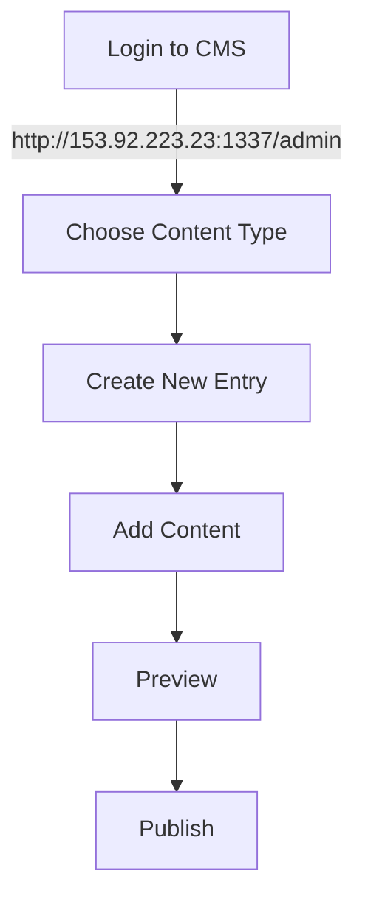

# Quick Start: Content Creation Guide

## Basic Content Creation Steps

## Step-by-Step Instructions

### 1. Creating a New Page

1. **Login & Navigate**
   - Go to http://153.92.223.23:1337/admin
   - Click "Content Manager" in sidebar
   - Select "Pages"
   - Click "Create new entry"

2. **Add Basic Info**
   - Title: Enter page title
   - Slug: Auto-generated (can be edited)
   - SEO fields will appear below

3. **Build Page Content**
   - Click "Add component" in Dynamic Zone
   - Choose component type:
     * Hero Section
     * Text Block
     * Feature Grid
   - Fill in component fields
   - Drag to reorder components

4. **Preview & Publish**
   - Click "Save" to save draft
   - Use Preview button to check layout
   - Click "Publish" when ready

### 2. Creating a Blog Post

1. **Start New Post**
   - Select "Blog Posts"
   - Click "Create new entry"

2. **Add Content**
   - Title
   - Content (rich text editor)
   - Featured Image
   - Categories/Tags

3. **SEO Settings**
   - SEO Title
   - Meta Description
   - Keywords

4. **Publish**
   - Save as draft or
   - Publish immediately

### 3. Creating a News Article

Similar to blog post, with additional fields:
- Publication Date
- Author
- News Category

## Quick Tips

### Images
- Recommended sizes:
  * Featured: 1200x630px
  * Content: min 800px width
- Always add alt text
- Optimize before upload

### SEO
- Title: 50-60 characters
- Description: 150-160 characters
- Include relevant keywords

### Components
- Hero: Top of page
- Text Block: Main content
- Feature Grid: Highlight key points

## Need Help?

- Check main [Content Workflow Guide](content_workflow_guide.md)
- Contact system admin for technical issues
- Use preview before publishing

## Revision History
- **Date:** 2025-01-16
- **Description:** Created quick start guide
- **Author:** AI
