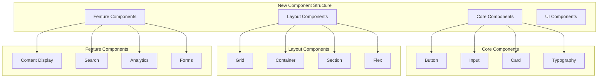
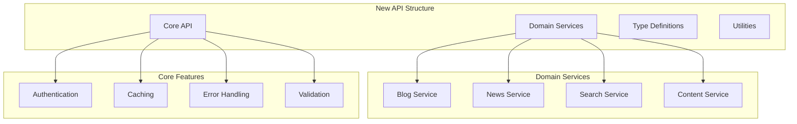

# Refactoring Implementation Plan

## Phase 1: Component Consolidation

### 1.1 Create Unified Component Library



#### Implementation Steps:
1. Create new component directory structure
   ```
   src/components/
   ├── core/
   ├── layout/
   ├── features/
   └── ui/
   ```

2. Implement base components:
   - Create unified Card component to replace BlogCard, NewsCard, WhitepaperCard
   - Implement shared content display component
   - Create standardized grid system
   - Build unified form components

3. Migration path:
   - Create new components alongside existing ones
   - Gradually migrate features to new components
   - Add comprehensive tests
   - Remove old components once migration is complete

### 1.2 API Layer Restructuring



#### Implementation Steps:
1. Create new API structure:
   ```
   src/lib/
   ├── api/
   │   ├── core/
   │   ├── blog/
   │   ├── news/
   │   └── search/
   ├── services/
   ├── types/
   └── utils/
   ```

2. Split current api.ts into domains:
   - Extract blog-related functionality
   - Separate news article handling
   - Isolate search functionality
   - Create shared core utilities

3. Implement proper type validation:
   - Add Zod schemas for API responses
   - Implement runtime type checking
   - Add comprehensive error handling
   - Create type guards for data mapping

### 1.3 Performance Optimization

#### Client-side Optimization:
1. Implement proper code splitting:
   ```typescript
   // Example dynamic import
   const BlogContent = dynamic(() => import('@/components/features/BlogContent'), {
     loading: () => <BlogSkeleton />,
     ssr: true
   });
   ```

2. Add strategic caching:
   ```typescript
   // Example SWR configuration
   const { data, error } = useSWR('/api/blog/posts', fetcher, {
     revalidateOnFocus: false,
     dedupingInterval: 60000
   });
   ```

3. Optimize bundle size:
   - Remove unused dependencies
   - Implement tree shaking
   - Use proper code splitting
   - Optimize image loading

#### Server-side Optimization:
1. Implement efficient data fetching:
   - Add proper caching headers
   - Optimize database queries
   - Implement request batching
   - Add response compression

2. Add performance monitoring:
   - Track page load times
   - Monitor API response times
   - Measure component render times
   - Track client-side performance

### 1.4 Code Organization

#### New File Structure:
```
src/
├── components/
│   ├── core/
│   ├── layout/
│   ├── features/
│   └── ui/
├── lib/
│   ├── api/
│   ├── services/
│   ├── types/
│   └── utils/
├── hooks/
├── contexts/
└── config/
```

#### Implementation Steps:
1. Create centralized utilities:
   - Move all utility functions to proper categories
   - Create shared helper functions
   - Implement proper type exports
   - Add comprehensive documentation

2. Standardize error handling:
   - Create error boundary components
   - Implement consistent error types
   - Add proper error logging
   - Create user-friendly error messages

3. Update documentation:
   - Add component documentation
   - Create API documentation
   - Update architecture diagrams
   - Add development guidelines

## Phase 2: Detailed Implementation

### 2.1 Component Migration

For each component category:
1. Create new base component
2. Add comprehensive tests
3. Migrate existing implementations
4. Remove old component
5. Update documentation

Example for Card component:
```typescript
// New unified card component
interface CardProps {
  title: string;
  content: string;
  image?: ImageType;
  type: 'blog' | 'news' | 'whitepaper';
  onClick?: () => void;
}

const Card: React.FC<CardProps> = ({
  title,
  content,
  image,
  type,
  onClick
}) => {
  // Implementation
};
```

### 2.2 API Service Implementation

For each domain service:
1. Create service class
2. Implement CRUD operations
3. Add proper validation
4. Add comprehensive tests
5. Update documentation

Example for Blog service:
```typescript
class BlogService {
  private api: ApiClient;
  
  constructor(api: ApiClient) {
    this.api = api;
  }

  async getPosts(params: GetPostsParams): Promise<BlogPost[]> {
    // Implementation
  }
}
```

### 2.3 Performance Monitoring

Implement monitoring system:
1. Add performance metrics
2. Create monitoring dashboard
3. Set up alerts
4. Track improvements

Example metrics:
- Page load time
- Time to first byte
- First contentful paint
- Largest contentful paint
- First input delay

## Phase 3: Testing and Validation

### 3.1 Test Implementation

For each component and service:
1. Unit tests
2. Integration tests
3. Performance tests
4. End-to-end tests

Example test structure:
```typescript
describe('BlogService', () => {
  describe('getPosts', () => {
    it('should return posts with correct structure', async () => {
      // Test implementation
    });

    it('should handle errors correctly', async () => {
      // Test implementation
    });
  });
});
```

### 3.2 Documentation

For each major change:
1. Update architecture docs
2. Add implementation details
3. Create usage examples
4. Update migration guides

## Next Steps

1. Begin with Component Consolidation phase
2. Create new component structure
3. Implement base components
4. Start gradual migration
5. Monitor performance metrics

Would you like me to proceed with implementing any specific part of this plan?