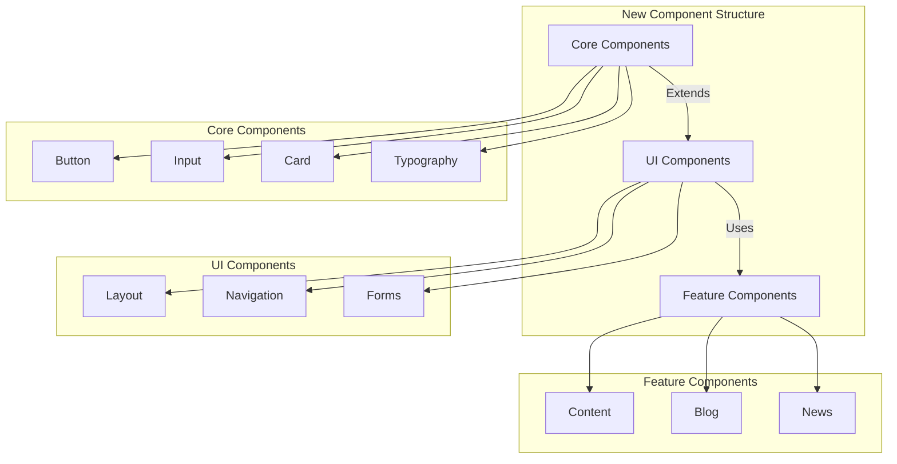
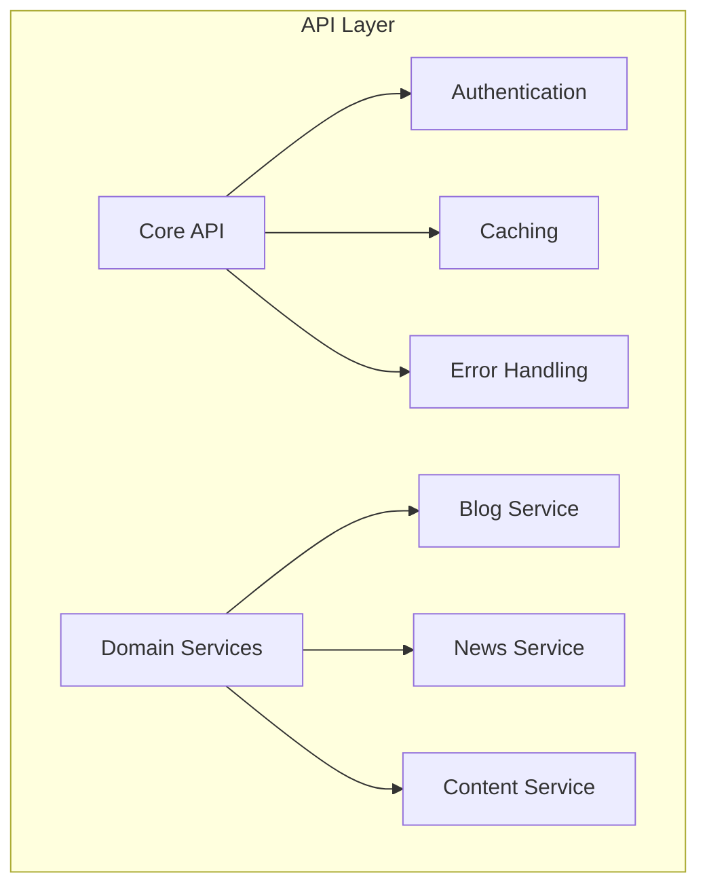
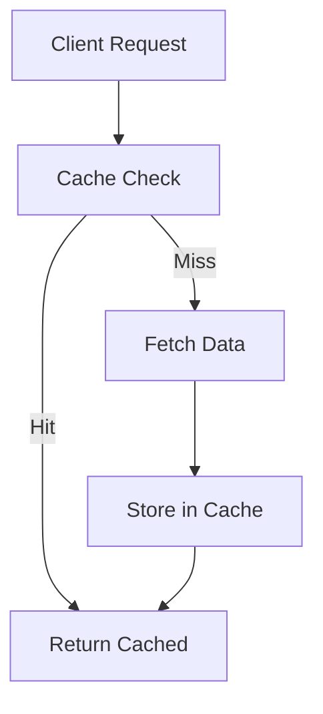
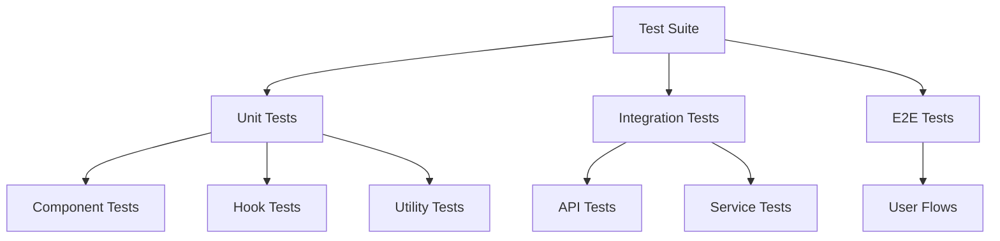

# Comprehensive Refactoring Proposal

Based on the detailed project structure analysis, this document outlines a comprehensive refactoring strategy to improve code quality, performance, and maintainability.

## 1. Component Architecture Refactoring

### 1.1 Unified Component Library


#### Implementation Steps:
1. Create new component structure:
```
src/components/
├── core/           # Base components
│   ├── Button/
│   ├── Card/
│   ├── Input/
│   └── Typography/
├── ui/             # Composed UI components
│   ├── Layout/
│   ├── Navigation/
│   └── Forms/
└── features/       # Feature-specific components
    ├── Content/
    ├── Blog/
    └── News/
```

2. Consolidate duplicate components:
- Merge BlogCard, NewsCard into unified Card component
- Create shared content display components
- Implement common form handling

## 2. API Layer Restructuring

### 2.1 Domain-Driven API Structure


#### Implementation:
1. Break down api.ts into domain services:
```
src/lib/api/
├── core/
│   ├── auth.ts
│   ├── cache.ts
│   └── error.ts
├── services/
│   ├── blog.ts
│   ├── news.ts
│   └── content.ts
└── types/
    └── index.ts
```

2. Implement consistent patterns:
```typescript
// Example service structure
class BlogService {
  private api: ApiClient;
  
  constructor(api: ApiClient) {
    this.api = api;
  }

  async getPosts(params: GetPostsParams): Promise<Result<BlogPost[]>> {
    return this.api.withErrorHandling(
      () => this.api.get('/blog-posts', params)
    );
  }
}
```

## 3. Performance Optimization

### 3.1 Caching Strategy


#### Implementation:
1. Implement strategic caching:
```typescript
// Example caching implementation
const withCaching = async <T>(
  key: string,
  fetchFn: () => Promise<T>,
  options: CacheOptions
): Promise<T> => {
  const cached = await cache.get(key);
  if (cached) return cached;
  
  const data = await fetchFn();
  await cache.set(key, data, options);
  return data;
};
```

2. Optimize data fetching:
- Implement request batching
- Add proper cache invalidation
- Use incremental static regeneration

## 4. Code Organization

### 4.1 New File Structure
```
src/
├── components/     # New component structure
├── lib/           # Core library code
├── services/      # Domain services
├── hooks/         # Custom hooks
├── utils/         # Utilities
└── types/         # TypeScript types
```

### 4.2 Type System Improvements
```typescript
// Example type improvements
interface BaseEntity {
  id: string;
  createdAt: string;
  updatedAt: string;
}

interface Content extends BaseEntity {
  title: string;
  slug: string;
  content: string;
  seoMetadata: SEOMetadata;
}

interface BlogPost extends Content {
  author: string;
  tags: string[];
}
```

## 5. Testing Strategy

### 5.1 Test Coverage


#### Implementation:
1. Component testing:
```typescript
describe('Card', () => {
  it('renders with basic props', () => {
    const { getByText } = render(
      <Card title="Test" content="Content" />
    );
    expect(getByText('Test')).toBeInTheDocument();
  });

  it('handles click events', () => {
    const onClick = jest.fn();
    const { getByRole } = render(
      <Card onClick={onClick} />
    );
    fireEvent.click(getByRole('button'));
    expect(onClick).toHaveBeenCalled();
  });
});
```

## 6. Implementation Phases

### Phase 1: Foundation (Weeks 1-2)
- Set up new component structure
- Create core components
- Implement type system improvements

### Phase 2: API Restructuring (Weeks 3-4)
- Break down api.ts
- Implement domain services
- Add proper error handling

### Phase 3: Performance (Weeks 5-6)
- Implement caching strategy
- Optimize data fetching
- Add performance monitoring

### Phase 4: Testing (Weeks 7-8)
- Implement test infrastructure
- Add component tests
- Create integration tests

## 7. Migration Strategy

### 7.1 Component Migration
1. Create new components alongside existing ones
2. Gradually migrate features to new components
3. Add comprehensive tests
4. Remove old components once migration is complete

### 7.2 API Migration
1. Create new API services
2. Implement feature flags for gradual rollout
3. Monitor performance and errors
4. Remove old implementation once stable

## 8. Success Metrics

1. **Performance**
- Page load time < 2s
- Time to interactive < 3s
- First contentful paint < 1s

2. **Code Quality**
- Test coverage > 80%
- Zero critical security issues
- Reduced bundle size

3. **Maintainability**
- Reduced duplicate code
- Improved type safety
- Better documentation

## 9. Risk Mitigation

1. **Technical Risks**
- Comprehensive testing before deployment
- Feature flags for gradual rollout
- Rollback procedures in place

2. **Business Risks**
- Minimal user impact during migration
- Maintain existing functionality
- Clear communication plan

## Next Steps

1. Review and approve refactoring proposal
2. Set up project milestones
3. Begin with foundation phase
4. Regular progress reviews
5. Continuous monitoring and adjustment