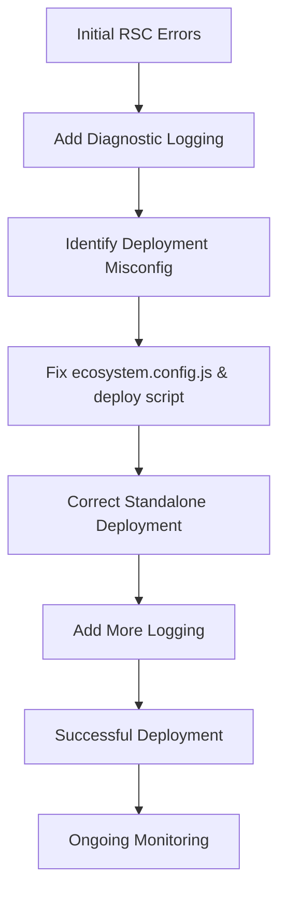

# RSC Debugging & Deployment Fixes — 2025-04-09

## 1. Initial Problem

- **React Hydration Error #418** encountered on the `/news` page.
- **RSC fetch failures** for routes like `/diensten?_rsc=ym5zp`.
- **TypeError** due to mismatched data structures between server and client components.

## 2. Investigation Steps

- **Added comprehensive diagnostic logging** in:
  - `app/news/page.tsx` (server component)
  - `src/components/features/NewsPageClient.tsx` (client component)
  - `src/components/features/NewsPageClientWrapper.tsx` (wrapper)
  - `src/lib/api.ts` (API layer)
- **Identified deployment issues:**
  - Next.js standalone output was not correctly handled.
  - PM2 was running from the wrong directory, causing missing assets and RSC failures.
- **Fixed deployment scripts and configuration:**
  - Updated `ecosystem.config.js`.
  - Modified `scripts/direct-deploy.ps1`.

## 3. Changes Made

### 3.1 Deployment Configuration

**ecosystem.config.js**

```js
module.exports = {
  apps: [{
    name: 'frontend',
    script: 'server.js',
    cwd: '.next/standalone', // Fixed working directory
    env: {
      PORT: 3000,
      NODE_ENV: 'production',
      NEXT_PUBLIC_API_URL: '/api/proxy'
    },
    post_update: [
      "npm install --legacy-peer-deps",
      "npm run build:prod",
      "cp -r node_modules .next/standalone/"
    ]
  }]
}
```

### 3.2 Deployment Script (`scripts/direct-deploy.ps1`)

- **Extracts build into `/var/www/frontend`**
- **Copies static assets and critical CSS into `.next/standalone`**
- **Installs dependencies and copies `node_modules` into `.next/standalone`**
- **Starts PM2 with:**

```bash
cd .next/standalone
NODE_ENV=production pm2 start server.js --name frontend --cwd /var/www/frontend/.next/standalone
```

Key deployment script improvements:

```bash
# Copy critical.css and ensure proper permissions
mkdir -p .next/standalone/app
cp app/critical.css .next/standalone/app/
chmod 644 .next/standalone/app/critical.css
chown www-data:www-data .next/standalone/app/critical.css

# Copy static assets with proper structure
mkdir -p .next/standalone/.next
cp -r .next/static .next/standalone/.next/
chmod -R 755 .next/standalone/.next/static
chown -R www-data:www-data .next/standalone/.next/static

# Fix permissions and ownership to avoid 403 errors
chown -R www-data:www-data /var/www/frontend
chmod -R 755 /var/www/frontend
```

### 3.3 Diagnostic Logging

**In `app/news/page.tsx`:**

```tsx
console.log('[NewsPage] Fetching articles with params:', { currentPage, pageSize });
console.log('[NewsPage] Raw API Response:', {
  hasResponse: !!articlesResponse,
  responseType: typeof articlesResponse,
  isArray: Array.isArray(articlesResponse?.articles),
  articleCount: articlesResponse?.articles?.length
});
console.log('[NewsPage] API Response Debug:', {
  responseReceived: !!articlesResponse,
  articlesPresent: !!articlesResponse?.articles,
  articlesLength: articlesResponse?.articles?.length,
  responseStructure: JSON.stringify(articlesResponse)
});
console.log('[NewsPage] Article structure:', {
  id: article.id,
  hasTitle: !!article.title,
  contentLength: article.content?.length,
  hasValidDates: {
    created: !!article.createdAt && !isNaN(new Date(article.createdAt).getTime()),
    updated: !!article.updatedAt && !isNaN(new Date(article.updatedAt).getTime()),
    published: article.publishedAt ? !isNaN(new Date(article.publishedAt).getTime()) : 'not set'
  }
});
```

**In `src/components/features/NewsPageClient.tsx`:**

```tsx
console.log('[NewsPageClient] Received props:', {
  hasPage: !!page,
  pageStructure: {
    id: page?.id,
    title: page?.title,
    hasValidDates: page ? {
      created: !!page.createdAt && !isNaN(new Date(page.createdAt).getTime()),
      updated: !!page.updatedAt && !isNaN(new Date(page.updatedAt).getTime())
    } : null
  },
  initialArticlesCount: initialArticles?.length
});

console.log('[NewsPageClient] SWR state update:', {
  hasData: !!data,
  dataLength: data?.length,
  currentSize: size,
  isLoading,
  hasError: !!error
});

console.log('[NewsPageClient] Articles processing:', {
  source: data ? 'SWR Data' : 'Initial Props',
  mergedCount: mergedArticles.length,
  articlesValidation: mergedArticles.map(article => ({
    id: article.id,
    isValid: !!(article.id && article.title && article.createdAt && article.updatedAt)
  }))
});
```

**In `src/components/features/NewsPageClientWrapper.tsx`:**

```tsx
console.log('[NewsPageClientWrapper] Received props:', {
  hasPage: !!page,
  pageDetails: {
    id: page?.id,
    title: page?.title,
    hasValidDates: page ? {
      created: !!page.createdAt && !isNaN(new Date(page.createdAt).getTime()),
      updated: !!page.updatedAt && !isNaN(new Date(page.updatedAt).getTime())
    } : null
  },
  articlesCount: articles?.length,
  articlesValid: articles?.every(article => (
    !!article &&
    !!article.id &&
    !!article.title &&
    !!article.createdAt &&
    !isNaN(new Date(article.createdAt).getTime())
  ))
});
```

**In `src/lib/api.ts`:**

```ts
console.log('[API Request] Detailed Debug:', {
  baseUrl,
  path,
  fullUrl: url,
  method: options.method || 'GET',
  headers: {
    ...getAuthHeaders(),
    ...options.headers
  }
});

console.log('[API Response] Detailed Debug:', {
  url,
  status: response.status,
  data: JSON.stringify(data, null, 2)
});

console.log('[getNewsArticles] Raw API response structure:', {
  hasData: !!data,
  dataType: typeof data,
  hasDataArray: !!data?.data,
  isDataArray: Array.isArray(data?.data),
  dataLength: data?.data?.length,
  hasMeta: !!data?.meta,
  metaStructure: data?.meta ? Object.keys(data.meta) : null
});
```

## 4. Current Status & Next Steps

- **Deployment now works correctly** with standalone output.
- **Extensive logging** is in place across server, client, and API layers.
- **Next Steps:**
  - Monitor logs for RSC fetch failures or hydration errors.
  - Further refine data validation and error handling.
  - Investigate any remaining edge cases in RSC serialization.

## Deployment & Debugging Flow



## Summary

This document details the debugging process for RSC errors, the deployment fixes applied, and the diagnostic logging added to facilitate ongoing monitoring and resolution. The combination of deployment configuration updates and comprehensive logging has resolved the initial issues and provides a foundation for identifying and addressing any future RSC-related problems.