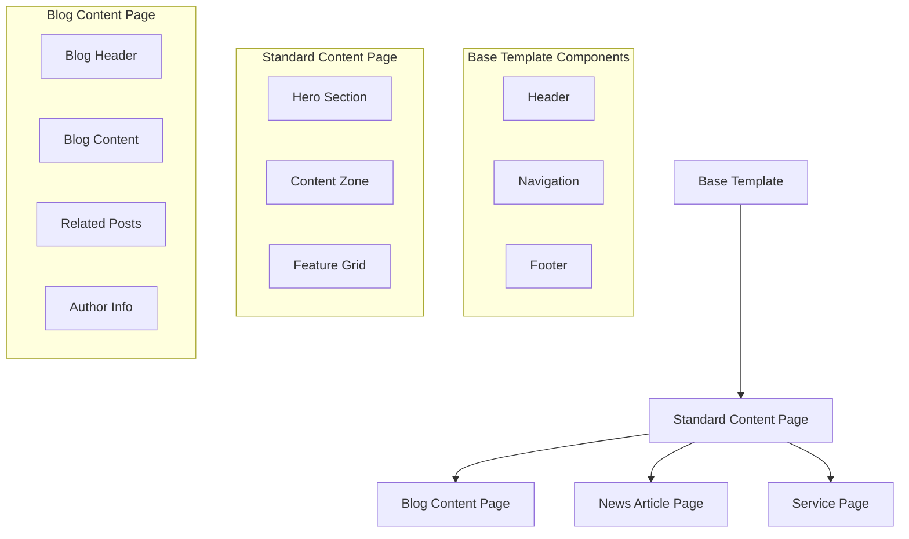
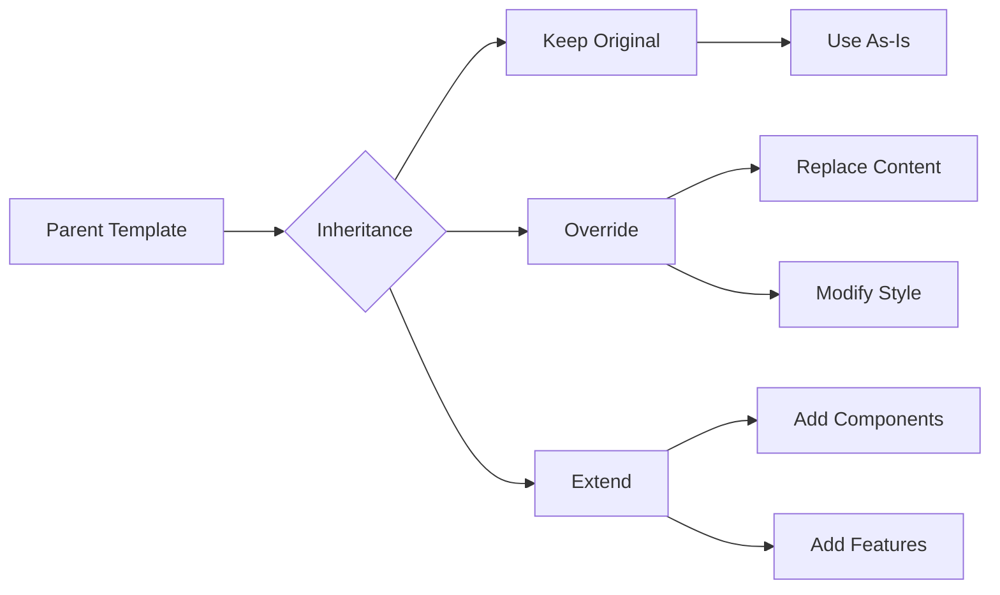

# Template Inheritance System
Last Updated: 2025-01-19

## Overview Diagram



## Component Inheritance Flow



## Template Structure

### Base Template
```typescript
interface BaseTemplate {
    layout: {
        header: HeaderComponent
        navigation: NavigationComponent
        mainContent: ContentZone[]
        footer: FooterComponent
    }
    styles: {
        theme: string
        customStyles?: Record<string, string>
    }
}
```

### Standard Content Page
```typescript
interface StandardContentPage extends BaseTemplate {
    layout: {
        // Inherited from BaseTemplate
        header: HeaderComponent
        navigation: NavigationComponent
        mainContent: [
            HeroComponent,
            ContentComponent,
            FeatureGridComponent
        ]
        footer: FooterComponent
    }
    styles: {
        theme: 'standard'
        customStyles: {
            contentWidth: 'wide'
            spacing: 'comfortable'
        }
    }
}
```

### Blog Content Page
```typescript
interface BlogContentPage extends StandardContentPage {
    layout: {
        // Inherited from StandardContentPage
        header: HeaderComponent
        navigation: NavigationComponent
        mainContent: [
            HeroComponent, // Inherited
            BlogContentComponent, // Override
            RelatedPostsComponent, // Add
            AuthorInfoComponent // Add
        ]
        footer: FooterComponent
    }
    styles: {
        theme: 'blog'
        customStyles: {
            contentWidth: 'readable'
            spacing: 'airy'
            typography: 'article'
        }
    }
}
```

## Inheritance Rules

### 1. Component Inheritance
- **Keep**: Use parent component as-is
- **Override**: Replace with new component
- **Extend**: Add new components to section

### 2. Style Inheritance
- **Theme**: Can be overridden
- **Layout**: Can be customized
- **Components**: Can have specific styles

### 3. Content Zones
- **Fixed Zones**: Header, Footer
- **Flexible Zones**: Main Content
- **Optional Zones**: Sidebars

## Implementation Example

```typescript
// Template inheritance configuration
const templateInheritance = {
    name: "Blog Template",
    parent: "Standard Content Page",
    overrides: {
        layout: {
            hero: {
                inherit: true,
                modifications: {
                    style: "blog-hero"
                }
            },
            content: {
                inherit: false,
                component: "BlogContent",
                settings: {
                    width: "readable",
                    includeAuthor: true
                }
            },
            features: {
                inherit: true,
                title: "Related Posts",
                component: "RelatedPosts"
            }
        },
        styles: {
            theme: "blog",
            typography: "article"
        }
    }
}
```

## Usage Flow

1. **Template Selection**
   ```mermaid
   graph LR
       A[Content Creation] --> B[Select Template]
       B --> C[Configure Overrides]
       C --> D[Preview]
       D --> E[Publish]
   ```

2. **Inheritance Resolution**
   ```mermaid
   graph TD
       A[Load Template] --> B[Check Parent]
       B --> C[Merge Components]
       C --> D[Apply Overrides]
       D --> E[Render Page]
   ```

## Revision History
- [2025-01-19] Initial diagram creation
- [2025-01-19] Added implementation examples
- [2025-01-19] Added inheritance rules
