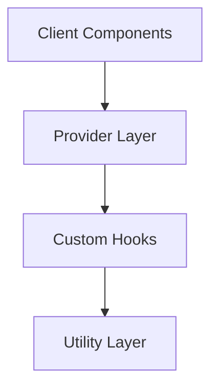
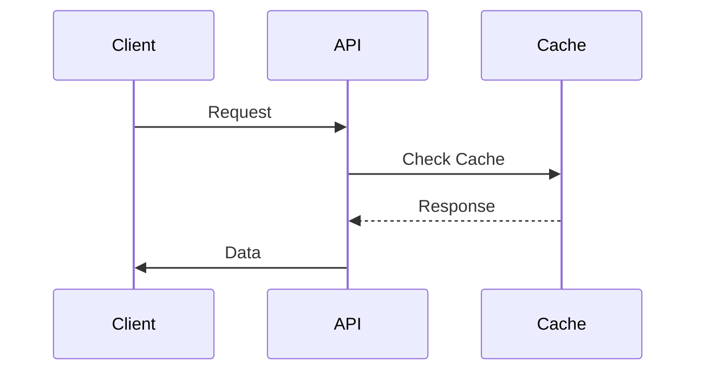

# Viewing Architecture Diagrams

To properly view the Mermaid diagrams in the architecture documentation, you have several options:

## Option 1: VSCode Extension
1. Install the "Markdown Preview Mermaid Support" extension in VSCode
2. Open the markdown file
3. Click the "Open Preview" button (or press Ctrl+Shift+V)

## Option 2: Online Mermaid Live Editor
1. Visit [Mermaid Live Editor](https://mermaid.live)
2. Copy the diagram code from the markdown file
3. Paste it into the editor to see the rendered diagram

## Option 3: GitHub
The diagrams will automatically render when viewing the markdown files on GitHub.

## Diagram Code Examples

Here's an example of how the diagrams should look when properly rendered:

### Core Systems Architecture

### Data Flow

## Tips for Diagram Viewing
1. Make sure your markdown viewer supports Mermaid syntax
2. The diagrams use standard Mermaid.js syntax
3. Each diagram is enclosed in a code block with the 'mermaid' language identifier
4. The diagrams will render automatically in supported environments

## Need Help?
If you're having trouble viewing the diagrams, try:
1. Using a different markdown viewer
2. Checking that your viewer supports Mermaid
3. Verifying the diagram syntax is correct
4. Using the online Mermaid editor as a fallback