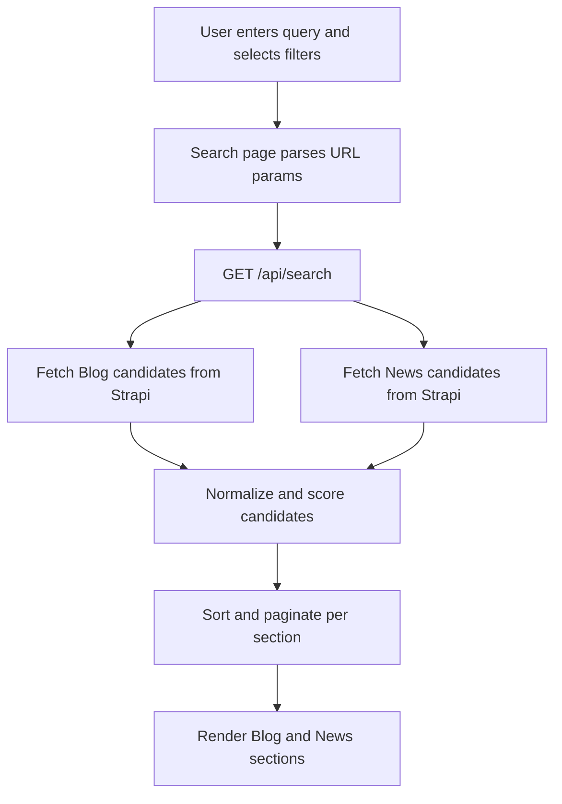
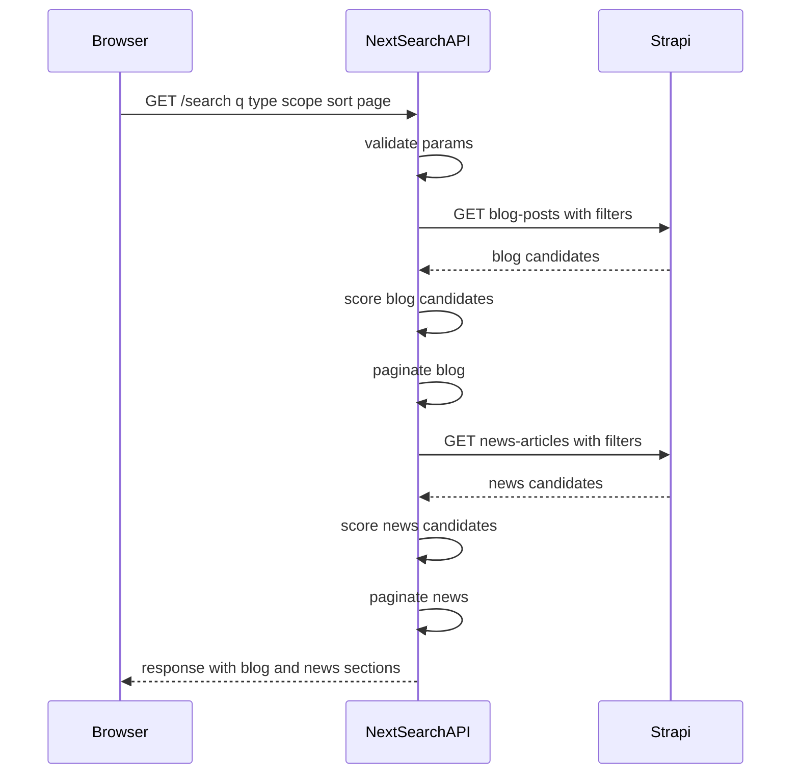

# Relevance-based Search Architecture with Field Scope Filtering (MaasISO)

Status: Proposed design (no implementation)

## 1. Goals

1. Relevance ranking with predictable weighting
   - Title matches should rank above summary / subtitle matches
   - Summary / subtitle matches should rank above content matches
2. Field scope filtering
   - Users can constrain search to specific fields (eg title-only)
3. Maintain existing UX structure
   - Keep separate result sections for Blog and News as currently rendered in [`SearchResults`](src/components/features/SearchResults.tsx:1)
4. Backwards compatibility
   - Existing search continues to work if `scope` is not provided

## 2. Current Implementation (Baseline)

### 2.1 Frontend entrypoint

The Search page parses URL parameters and calls the API search function in [`SearchPage`](src/app/search/page.tsx:1).

Current URL parameters:
- `q` query string
- `type` content type filter
- `dateFrom` and `dateTo`
- `sort`
- `page`

### 2.2 Current Strapi filtering behavior

The current `search()` uses Strapi `$containsi` on `title` and `content` only, and forwards Strapi sorting:
- See [`search()`](src/lib/api.ts:864) where filters are built at [`filters[$or][0][title][$containsi]`](src/lib/api.ts:880) and [`filters[$or][1][content][$containsi]`](src/lib/api.ts:881)

Known limitations:
- No relevance scoring (Strapi just returns filter matches)
- Summary fields are not part of query
- Sorting by `relevance` is not real relevance (it is passed as Strapi `sort`)

### 2.3 Filter UI

Current filter UI handles type, dates, and sort in [`SearchFilters`](src/components/features/SearchFilters.tsx:1). There is no field scope control yet.

## 3. Proposed Architecture

Choose **Option B: Custom API endpoint**.

### 3.1 Why Option B

- Enables correct relevance ordering within each section (Blog vs News) and correct pagination for that ordering.
- Avoids needing to fetch all matches into the browser.
- Keeps current page structure (two lists) intact.

### 3.2 Proposed components

1. New API route: `GET /api/search`
   - Implemented as a Next.js Route Handler (planned location: `app/api/search/route.ts`)
   - Responsibilities:
     - Validate params
     - Query Strapi per content type with minimal pre-filtering
     - Score items with deterministic algorithm
     - Sort and paginate per section
2. Frontend: add `scope` to URL and to API params
   - Update filter UI to include scope selection
   - Default scope to `all`

Note: This design keeps Strapi unchanged. The new endpoint lives in the frontend app and acts as a search orchestrator.

## 4. Field Scope Filtering

### 4.1 Scope options

Keep a small set of user-facing scopes to avoid confusion:

| Scope key | Label (NL) | Blog fields searched | News fields searched |
|---|---|---|---|
| `all` | Alles | `title`, `summary`, `content` | `title`, `summary`, `articledescription`, `content` |
| `title` | Alleen titel | `title` | `title` |
| `title-summary` | Titel + samenvatting | `title`, `summary` | `title`, `summary`, `articledescription` |
| `content` | Alleen tekst | `content` | `content` |

Rationale:
- Covers the main user intents without a combinatorial explosion.
- Matches the stated requirement: everything, title-only, text-only, and a middle ground.

### 4.2 URL parameter contract

Add:
- `scope=all|title|title-summary|content`

Defaults:
- If `scope` is absent, treat as `all` (backwards compatible).

### 4.3 How scope interacts with relevance scoring

Scope does two things:
1. Determines which fields are eligible to contribute to the score.
2. Determines which fields are used in the Strapi pre-filter query (to reduce load).

If a field is excluded by scope, it must contribute a score of 0 even if it contains the query.

## 5. Relevance Scoring Algorithm

This section defines a deterministic scoring model that is:
- Case-insensitive
- Supports partial matches
- Handles multiple occurrences without letting long content dominate

### 5.1 Text normalization

For each field text and the user query:
- Lowercase
- Strip diacritics (eg é → e) if feasible
- Replace punctuation with spaces
- Collapse whitespace

Define `normalized(text)`.

### 5.2 Tokenization

Split the normalized query into tokens by whitespace.

Example:
- Query: `iso 27001 certificering`
- Tokens: `iso`, `27001`, `certificering`

We do not apply aggressive stemming initially. Keep behavior transparent.

### 5.3 Match types

For each token `t` and each field `F`, count:

1. Exact word matches
   - Match when `t` equals a full word boundary token in `F`
2. Prefix matches
   - Match when a word in `F` starts with `t`
3. Substring matches
   - Match when `t` occurs inside a word in `F`

Priorities and weights per match type:
- Exact: multiplier `1.0`
- Prefix: multiplier `0.7`
- Substring: multiplier `0.3`

### 5.4 Field weights

Base weights (per match event):

| Field | Weight |
|---|---:|
| `title` | 10 |
| `summary` | 5 |
| `articledescription` | 5 |
| `content` | 1 |

These weights satisfy: title > summary > content.

### 5.5 Multiple matches in the same field

To avoid long `content` fields dominating, use log scaling per token per field.

For each token `t` and field `F`, let:
- `cExact` = count of exact word matches
- `cPrefix` = count of prefix matches
- `cSub` = count of substring matches

Compute a token-field contribution:

`contrib(t, F) = W(F) * (
  1.0 * log2(1 + cExact) +
  0.7 * log2(1 + cPrefix) +
  0.3 * log2(1 + cSub)
)`

Total field score:

`fieldScore(F) = sum over tokens t of contrib(t, F)`

Total item score:

`score(item) = sum over eligible fields F of fieldScore(F)`

Optional phrase bonus (only when query has 2+ tokens):
- If `normalized(field)` contains the full `normalized(query)` substring, add:
  - `phraseBonus(title)=6`
  - `phraseBonus(summary or articledescription)=3`
  - `phraseBonus(content)=1`

This rewards exact phrase presence without requiring it.

### 5.6 Tie-breakers

Within each section (Blog, News):
1. Primary: `score` descending
2. Secondary: `publishedAt` descending
3. Tertiary: `title` ascending

### 5.7 Worked example (illustrative)

Query: `iso 27001`

Item A:
- title contains exact word match for both tokens
- content contains multiple substring matches

Item B:
- title contains only one token
- summary contains the other token

Item A should rank above Item B because title exact matches dominate.

## 6. Implementation Approach (Custom /api/search)

### 6.1 Endpoint

`GET /api/search`

Query params (all strings):
- `q` required
- `type` optional: `blog|news` (if absent, search both)
- `scope` optional: `all|title|title-summary|content` (default `all`)
- `dateFrom` optional: ISO date
- `dateTo` optional: ISO date
- `sort` optional: `relevance|date|title` (default `relevance`)
- `page` optional: integer (default `1`)
- `pageSize` optional: integer (default `10`)

### 6.2 Strapi query strategy

Because Strapi does not provide relevance scoring, the endpoint must:
1. Ask Strapi for the set of candidate matches (pre-filter)
2. Score and order locally
3. Apply pagination after ordering

Recommended pre-filter logic:
- For each query token, require it to match at least one scoped field.
- This can be expressed as an `$and` of `$or` groups.

Example (conceptual) for token t0 and t1:
- `filters[$and][0][$or][0][title][$containsi]=t0`
- `filters[$and][0][$or][1][summary][$containsi]=t0`
- `filters[$and][1][$or][0][title][$containsi]=t1`
- ...

This reduces noisy matches for multi-token queries.

### 6.3 Correct pagination by relevance

To paginate correctly by relevance, the server must score the full candidate set for the section.

Practical constraints:
- Fetching all matches can be expensive.

Mitigation:
- Enforce a hard cap per section, eg `MAX_CANDIDATES_PER_TYPE=1000`.
- If total candidates exceed the cap, return a warning flag in response metadata.
- This keeps correctness within the cap, and is a stepping stone to a future search engine integration.

### 6.4 Sorting behavior

If `sort=relevance`:
- Sort by computed `score` desc.

If `sort=date` or `sort=title`:
- Sort by that field (server-side), but still compute and return `score` for transparency and debugging.

### 6.5 Response structure (sectioned)

Return two sections (or one if `type` specified):

- `blog`
  - `items`: scored hits
  - `meta`: pagination and totals
- `news`
  - same
- `meta`
  - echo params and flags

## 7. Type Definitions and API Contract

### 7.1 TypeScript types (frontend)

Add these types (planned location: extend [`src/lib/types.ts`](src/lib/types.ts:257) or create a dedicated search types module).

```ts
export type SearchScope = 'all' | 'title' | 'title-summary' | 'content';

export interface SearchParamsV2 {
  query: string;
  scope?: SearchScope; // default all
  filters?: {
    contentType?: ('blog' | 'news')[];
    dateFrom?: string;
    dateTo?: string;
  };
  sort?: {
    field: 'date' | 'relevance' | 'title';
    direction: 'asc' | 'desc';
  };
  page?: number;
  pageSize?: number;
}

export interface SearchHitBase {
  id: string;
  type: 'blog' | 'news';
  title: string;
  slug: string;
  publishedAt?: string;
  summary?: string;
  content?: string;
  relevanceScore: number;
  relevanceBreakdown?: {
    title?: number;
    summary?: number;
    articledescription?: number;
    content?: number;
    phraseBonus?: number;
  };
}

export interface SearchSection<TItem> {
  items: TItem[];
  meta: {
    total: number;
    page: number;
    pageSize: number;
    pageCount: number;
    truncated?: boolean;
    candidateCount?: number;
  };
}

export interface SearchResponseV2 {
  blog?: SearchSection<SearchHitBase>;
  news?: SearchSection<SearchHitBase>;
  meta: {
    query: string;
    scope: SearchScope;
    sort: 'relevance' | 'date' | 'title';
  };
}
```

### 7.2 Backwards compatibility strategy

Current call path:
- [`SearchPage`](src/app/search/page.tsx:24) builds [`SearchParams`](src/lib/types.ts:260) and calls [`search()`](src/lib/api.ts:864).

Migration approach:
1. Extend [`SearchParams`](src/lib/types.ts:260) with optional `scope?: SearchScope`.
2. Keep `scope` absent treated as `all`.
3. Implement `GET /api/search` endpoint.
4. Update [`search()`](src/lib/api.ts:864) to call `/api/search` (internal fetch) and map response back into the existing `{ blogPosts, newsArticles }` shape so existing UI keeps working.
   - Add a new function `searchV2()` returning `SearchResponseV2` for future UI enhancements.
5. Update filter UI to write `scope` to URL.
6. Optional: progressively expose `relevanceScore` in UI for debugging (behind feature flag).

## 8. Data Flow and Sequence Diagrams

### 8.1 Data flow (high-level)



### 8.2 Sequence (per request)



## 9. Risks and Future Improvements

### 9.1 Candidate cap

If content grows large, fetching up to a cap (eg 1000) may not be sufficient for fully correct relevance paging.

Future path:
- Integrate a dedicated search engine (Meilisearch, Algolia, Elasticsearch) and keep the same `scope` and response contract.
- The scoring model can map to search engine field boosts.

### 9.2 Language and stemming

Dutch language morphology (eg certificeren, certificering) may reduce match quality.

Future path:
- Add optional stemming for Dutch
- Add synonyms for common terms

---

Design references:
- Current search implementation: [`search()`](src/lib/api.ts:864)
- Current filters UI: [`SearchFilters`](src/components/features/SearchFilters.tsx:1)
- Current search page: [`SearchPage`](src/app/search/page.tsx:1)

